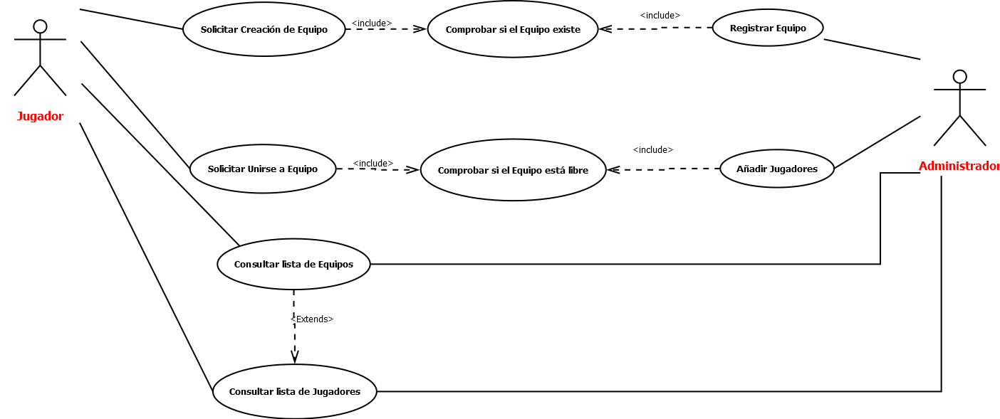
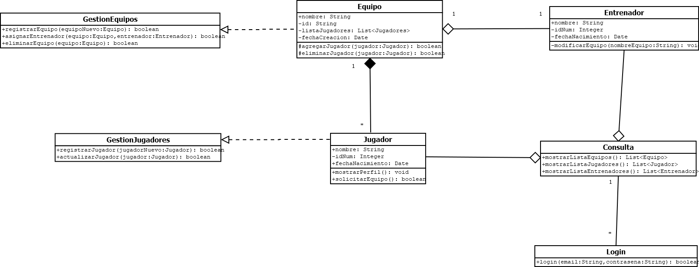

# Sistema de Gestión de Torneos de eSports

## Autor
Elia Martínez Moral
eliamoral

## Descripción del Proyecto

https://github.com/eliamoral/torneo-esports-uml.git

Este proyecto implementa un sistema de gestión de torneos de eSports utilizando UML para el modelado y Java para la implementación.

## Diagramas UML
### Diagrama de Casos de Uso 

### Diagrama de Clases

## Estructura del Proyecto

torneo-esports-uml/ ├── src/ 
│ ├── es/empresa/torneo/ 
│ │ ├── modelo/ 
│ │ ├── control/ 
│ │ ├── vista/ 
│ │ ├── Main.java 
├── diagrams/ 
│ ├── casos-uso.png 
│ ├── clases.png 
├── README.md 
├── .gitignore
├── LICENSE (opcional)

## Instalación y Ejecución
1. Clonar el repositorio:
`git clone https://github.com/eliamoral/torneo-esports-uml.git`

2. Compilar y ejecutar el proyecto:
`cd src javac es/empresa/torneo/Main.java java es.empresa.torneo.Main`

## Justificación del diseño
### Análisis del problema y requisitos del sistema

Los actores principales que interactúan con el sistema son: 
1.	Jugadores: Son los usuarios que participan activamente en los Esports y pueden consultar los resultados y ver los equipos donde se encuentran.
2.	Administradores: Son los usuarios que gestionan los equipos y los jugadores. Tienen el poder de gestionar la plataforma de forma más libre.
3.	Sistema: Es un usuario que automatiza procesos y sirve para generar resultados, actualizar las clasificaciones, asignar recompensas, etc.

Las acciones que puede realizar cada actor, según los correspondientes a la Gestión de Equipos y Jugadores son: 
-	Jugadores: Consultar listas (de equipos, jugadores, entrenadores…)
-	Administradores: Gestionar equipos, añadir jugadores, consultar listas.
A parte de estos casos de uso están los de: 
-	Sistema: Genera emparejamientos y resultados, actualiza clasificaciones y asigna premios.

Las relaciones entre las entidades del sistema son:
-	Los Equipos tienen varios Jugadores.
-	Cada Jugador pertenece a un Equipo.
-	Cada Entrenador tiene un Equipo.
-	Los Jugadores participan en Torneos y juegan Partidas.
-	En un Torneo hay varias Partidas.

### Identificación de los casos de uso y clases

Las clases principales en función de los casos de uso seleccionados son:
Jugador, Equipo y Entrenador.

Distinguimos los diferentes tipos de clases:
1.	Clases de Entidad: Jugador, Entrenador y Equipo. Porque representan los objetos del mundo real dentro de este modelo estructural del sistema, que tendrán atributos propios además de métodos.

2.	Clases de Control: GestionEquipos y GestionJugadores. He escogido dos tipos porque necesita administrar la lógica del sistema, partiendo de las Entidades.

3.	Clases de Interfaz: Login y Consulta. Porque se encargarán de ser un puente de comunicación entre el programa y el usuario.

Métodos y atributos de las clases:
-	Jugador: 
| Atributos: nombre, idNum y fechaNacimiento.
| Métodos: mostrarPerfil(), solicitarEquipo().

-	Entrenador: 
| Atributos: nombre, idNum y fechaNacimiento.
| Métodos: modificarEquipo(String nombre)

-	Equipo: 
| Atributos: nombre, id, listaJugadores y fechaCreacion.
| Métodos: agregarJugador(Jugador jugador), eliminarJugador(Jugador jugador).

-	GestionEquipos
| Métodos: registrarEquipo(Equipo equipo), asignarEntrenador(Equipo equipo, Entrenador entrenador) y eliminarEquipo(Equipo equipo).

-	GestionJugadores
| Métodos: registrarJugador(Jugador jugador), actualizarJugador(Jugador jugador).

-	Login
| Métodos: login(email String, contrasena String) 

-	Consulta
| Métodos: mostrarListaEquipos(), mostrarListaJugadores(), mostrarListaEntrenadores().

Las relaciones entre las clases son las siguientes:
-	Los Jugadores tienen solo un Equipo cada uno.
-	Los Jugadores componen los Equipos.
-	Un Equipo tiene un Entrenador.
-	Accedemos a la pantalla Consulta mediante la de Login.
-	Una Consulta proviene de Jugadores, Equipos y Entrenadores. Esto es debido a que la información parte de estas entidades.
-	GestionEquipos proviene de los Equipos. Esto se debe a que la administración de los Equipos depende de sus propios parámetros.
-	GestionJugadores proviene de los Jugadores. Esto se debe a que la administración de los Jugadores depende de sus propios parámetros.

### Creación del diagrama de clases UML

A continuación se especifican las relaciones con cardinalidades y visibilidades:
-	Un Equipo tiene varios Jugadores.
-	El Jugador solo tiene un Equipo.
-	El Equipo tiene un Entrenador y el Entrenador pertenece solo a un Equipo.
-	Un Login tiene varias Consultas.
-	Las Consultas solo tienen un Login.

-	Entrenador: sus atributos y métodos son privados excepto su nombre.
-	Jugador: todos los atributos y métodos son públicos excepto su Id.
-	Equipo: sus atributos y métodos privados/protegidos excepto su nombre. Los protegidos son para que el Entrenador pueda acceder a ellos, pero los Jugadores no.
-	El resto de Entidades tienen los métodos públicos.

## Conclusiones

En esta actividad he aprendido a elaborar diversos tipos de diagramas que son importantes para el diseño de sistemas de gestión de empresas y organizaciones.
He entendido mejor la estructura que deben de tener las clases según cómo se organicen en los diagramas. 
También he practicado la elaboración de documentación alrededor del diseño y de la programación orientada a objetos, considero que me será muy útil a la hora de enfrentarme a un caso real.